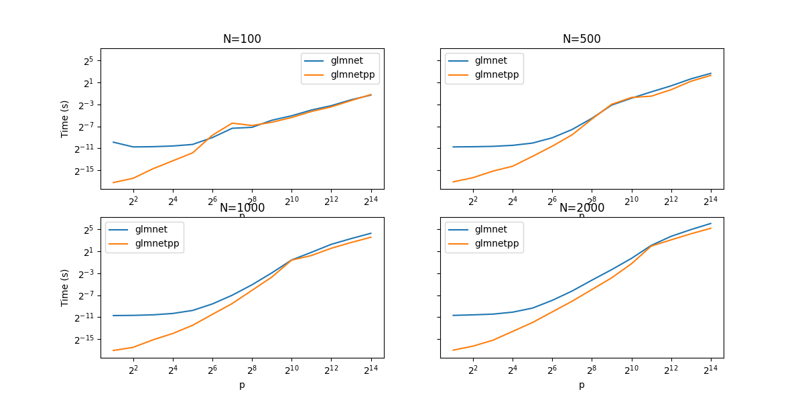

# glmnet++

## Overview

The R package [glmnet](https://github.com/cran/glmnet) is a widely-used elastic net solver.
As described on the [glmnet home page](
https://glmnet.stanford.edu/articles/glmnet.html#introduction-1),
`glmnet`'s speed and efficiency comes from using FORTRAN subroutines
that implements the coordinate descent algorithm.
Inspired by the implementation ideas of `glmnet`,
we wanted to see if a C++ implementation could improve both memory usage and speed.

`glmnet++` is an implementation of `glmnet`
using C++ rather than FORTRAN subroutines.

`glmnet++` is still in a development phase.

## Benchmarks

### Random Uniform(-1,1) Generated X, y

In this toy example, we generate the data matrix `X` and the response vector `y`
where each entry is drawn as iid `Uniform(-1,1)`.
Letting `n` be the number of responses and `p` be the number of features,
we consider various values of `n` and `p` and compare the lasso fit
using `glmnet++` and `glmnet`.

The data was pre-generated and both packages used the same data.
All data was standardized before performing lasso.
Since `glmnet++` currenotly only implements the covariance method [[1]](#1),
we fix this method for `glmnet` as well.

The following is a collection of benchmarks for 
`n = {100, 500, 1000, 2000}` (`N`) and 
`p = {2^1, 2^2, ..., 2^14}`. 

We see that with the exception of `n=100` and `p=2^7`,
`glmnet++` is faster than `glmnet`.
Note that for simplicity, we timed the R function `glmnet`.
Hence, for smaller values of `p`, the comparison is not reliable as
most of the computation is being done by the R interpreter when parsing through the function call.
However, after a point at which the two packages run at similar times, 
the coordinate descent dominates the computation time, so the comparison is valid.
For the largest value of `p`, 
the relative time (`glmnet time / glmnet++ time`)
is approximately `[0.9, 1.3, 1.7, 1.8]` for `n = [100, 500, 1000, 2000]`,
respectively.

## References

<a id="1"> [1] </a> 
Friedman, Jerome, Trevor Hastie, and Rob Tibshirani. 2010. “Regularization Paths for Generalized Linear Models via Coordinate Descent.” Journal of Statistical Software, Articles 33 (1): 1–22. https://doi.org/10.18637/jss.v033.i01.
